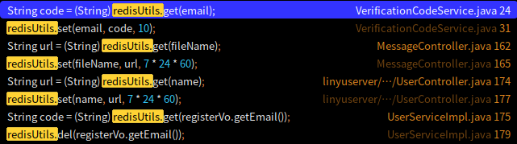
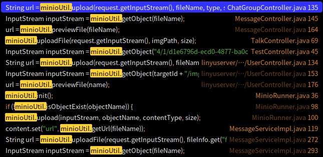
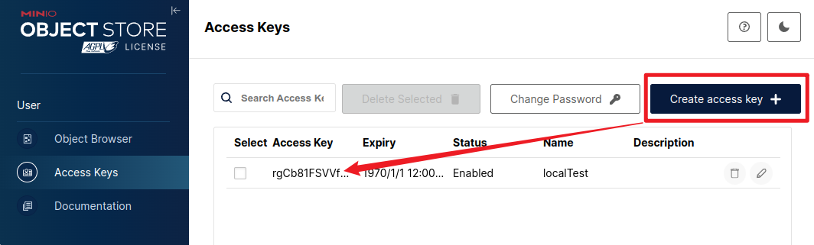

# 技术报告
- **项目背景**
随着移动设备和桌面设备的普及，用户希望能够在不同设备上无缝切换，享受**一致**的聊天体验。本项目旨在开发一款跨平台聊天软件，以满足用户多样化的沟通需求。

- **项目目标**
  跨平台：支持在Windows、macOS、Linux、(v2支持iOS和Android)等多平台上运行
  多种聊天功能：包括文本/语音/文件消息、音视频聊天等
  数据安全和用户隐私：采用行业级的加密技术和认证机制，保护用户数据和隐私
  集成语音转文字功能：利用Fast-Whisper，实现语音消息的实时转文字功能

---
# 功能模块
<row>
<div>

- 好友管理
  - 添加/删除好友
  - 好友列表
- 朋友圈
  - 发布动态
  - 点赞和评论
</div>

<div>

- 聊天功能
  - 音视频聊天
  - 语音消息
  - 文本消息
  - 文件消息
  - 图片消息
  - 截图功能
  - 语音转文字
</div>
</row>

---
# 部署
```bash
git clone https://github.com/DWHengr/linyu-server.git #后端
cd deploy/compose
vim .env broker.conf #密码、smtp邮箱、voice model、minio accessKey
docker-compose up -d #拉取组合镜像
xdg-open http://localhost:9001/access-keys #手动添加accessKey
```


---
# 系统架构
- 前端架构
  - Tauri 与 React 的集成
  - WebRTC 实现音视频聊天
  - Router 和 Redux 的使用
- 后端架构
  - Spring Boot 服务
  - Netty WebSocket 通信
  - JWT 认证机制
  - 数据存储 (MySQL, Redis, MinIO)
  - Fast-Whisper 语音转文字服务
---
## React: useEffect
useEffect 是一个在组件生命周期中执行副作用操作的 Hook，比如数据获取、订阅或者手动更改 DOM。；类似vue3中的`watchEffect`+`onMounted`/`onUnmounted`。
```jsx
import React, { useEffect } from 'react';
function Example() {
  useEffect(() => {
    const fetchData = async () => {
      const data = await fetch('https://api.example.com/');
    };
    fetchData();

    return () => {
      console.log('清理操作');
    };
  }, []); // 空数组意味着这个 effect 只会在组件挂载和卸载时运行一次

  return (<div>Hello World</div>);
}
```
---
## React: useState
一个用于添加状态的 Hook，它允许函数**组件拥有状态**。类似vue3中`ref()`/`reactive()`
```jsx
import React, { useState } from 'react';

function Example() {
  const [count, setCount] = useState(0);

  return (
    <div>
      <p>You clicked {count} times</p>
      <button onClick={() => setCount(count + 1)}>
        Click me
      </button>
    </div>
  );
}
```
---
## React: useRef
返回一个**可变**的 ref 对象，其 `.current` 属性被初始化为传入的参数（`initialValue`）。返回的 ref 对象在组件的**整个生命周期**内保持不变。类似vue3中的`ref()`
```jsx
import React, { useRef } from 'react';

function Example() {
  const inputEl = useRef(null);

  const handleClick = () => {
    inputEl.current.focus();
  };

  return (
    <>
      <input ref={inputEl} type="text" />
      <button onClick={handleClick}>Focus the input</button>
    </>
  );
}
```

---
<foot>https://developer.mozilla.org/zh-CN/docs/Web/API/WebRTC_API
https://blog.csdn.net/m0_72410588/article/details/132267144
</foot>

## webRTC
无需安装插件或第三方软件，就能实现<ruby>点对点<rt>P2P</rt></ruby>数据共享和电话会议
### 1. ICE服务器说：“能否公网IP直连？”
ICE利用**STUN**协议，允许设备查询其在NAT后面的公共IP地址和端口号，然后将这些信息发送给对方设备，以便建立连接。
### 2. TURN服务器说：“不，只能`对称型NAT`穿透”
成本高、开销大。
ICE返回的STUN包中，告知是“对称型NAT”时，我方决定**全部由TURN中转**，绕开NAT。

---
<foot>https://blog.csdn.net/weixin_46999174/article/details/140548449</foot>

### 3. 信令服务器说：“媒体信息协商”
A端和B端要同时采用**对方都支持的<ruby>编解码器<rt>H264 VP9等</rt></ruby>**
1. **交换SDP*_(Session Description Protocol)_
SDP消息包含了媒体类型、编解码器、带宽等信息，确保两端能够兼容通信。
    - `Offer/Answer`：当A端点想与B端点建立连接时，A会创建一个SDP offer，并通过信令服务器发送给B端点。B端点接收到offer后，生成一个SDP answer，并通过信令服务器返回给A端点。
1. **交换ICE候选者*_(Interactive Connectivity Establishment Candidates)_
为了建立P2P连接，双方需要交换多个网络候选者，以确定**最佳的通信路径**。信令服务器在这个过程中**传递**这些候选者信息。
1. 传递控制消息
通话控制：信令服务器也用于**传递其他控制消息**，如挂断、静音、解除静音等操作。

---

流程图

---
## webRTC:前端代码
```jsx
const initRTCPeerConnection = () => {
    const iceServer = {
        iceServers: [{
            url: "stun:stun.l.google.com:19302",
//STUN服务器用于帮助发现本地和公共IP地址以及端口。类似DHCP
        }, {
            url: "turn:numb.viagenie.ca",
            username: "webrtc@live.com",
            credential: "muazkh",
//TURN服务器作为中继，当直接连接不可用时，通过TURN服务器转发数据包。
        },],
    };
    pc.current = new RTCPeerConnection(iceServer);
    pc.current.oniceconnectionstatechange = handleICEConnectionStateChangeEvent;
//在 ICE 连接状态改变时触发
    pc.current.onicecandidate = handleICECandidateEvent;
//VideoApi.candidate({userId: toUserId.current, candidate: event.candidate})
    pc.current.ontrack = handleTrackEvent;
//remote.current.srcObject = event.streams[0];
};
```
---
src/pages/VideoChat/index.jsx
```jsx
const videoCall = async () => {
    try {
        webcamStream.current = await navigator.mediaDevices.getUserMedia({
            video: !isOnlyAudioRef.current, audio: true,
        });
        local.current.srcObject = webcamStream.current;
        local.current.muted = true;
        webcamStream.current.getTracks().forEach(
            (track) => pc.current.addTrack(track, webcamStream.current)
        );
    } catch (e) {
        showToast("相机/麦克风权限未允许~", true)
    }
}
```
---
## webRTC:后端代码
com.cershy.linyuserver.service.VideoService
```java
public class VideoService {
    @Resource
    FriendService friendService;
    @Resource
    WebSocketService webSocketService;
    public boolean offer(String userId, OfferVo offerVo) {
        boolean isFriend = friendService.isFriend(userId, offerVo.getUserId());
        if (!isFriend) {
            throw new LinyuException("双方非好友");
        }
        JSONObject msg = new JSONObject();
        msg.set("type", "offer");
        msg.set("desc", offerVo.getDesc());//调用不同Vo
        msg.set("fromId", userId);
        webSocketService.sendVideoToUser(msg, offerVo.getUserId());
        return true;
    }
}
```

---
## Router
对标vue的vue-router。这里是项目内的简单使用：
```jsx
return (
  <div onContextMenu={(e) => e.preventDefault()}>
    <Switch>
      <Route path="/login" component={Login}></Route>
      <Route path="/home" component={Home}></Route>
      <Route path="/tray" component={TrayMenu}></Route>
      <Redirect path="/" to="/login" />
    </Switch>
  </div>
);
```
---
## Redux
对标vue的pinia。不过每次都要写`store`,`actions`,`reducers`

<row>
<div>

### store.js
```jsx
export const setCurrentLoginUserInfo = (
  userId, username, account, portrait
) => {
  return {
    type: type.Set_User_Info,
    userId,
    username,
    account,
    portrait
  };
};
```
</div><div style="margin-left: 30px">

### actions.js
```jsx
import as type from "./type";
let defaultState = {
    userId: "",
    username: "",
    account: "",
    portrait: "",
};

export const homeData = (state = defaultState, action) => {
    switch (action.type) {
        case type.Set_User_Info:
            return {
                ...state,
                ...action,
            };
        default:
            return state;
    }
};
```
</div>
</row>

---
<foot>https://blog.csdn.net/u010416101/article/details/118664733</foot>

### Springboot三层架构
- Dao: <ruby>DO<rt>Domain Obj</rt></ruby>，实际上DO更像<ruby>PO<rt>Persistent</rt></ruby>：<ruby>CRUD<rt>增查改删</rt></ruby>数据库中的一条对象
- Service: <ruby>BO<rt>Business</rt></ruby>，<ruby>业务对象<rt>可复用的逻辑处理</rt></ruby>
- Controller: <ruby>VO<rt>Value</rt></ruby>，后端向前端传值

<row>
<div>

#### Service/DAO 层方法命名规约

获取单个对象的方法用`get`做前缀
获取多个对象的方法用`list`做前缀
获取统计值的方法用`count`做前缀
插入的方法用`save`/`insert`做前缀
删除的方法用`remove`/`delete`做前缀
修改的方法用`update`做前缀

</div>
<div>

#### 领域模型命名规约

数据对象：xxxDO，xxx为`数据表名`
数据传输对象：xxxDTO，xxx为`业务领域相关的名称`
展示对象：xxxVO，xxx一般为`网页名称`
**POJO是**DO/DTO/BO/VO的**统称**，**禁止命名**成xxxPOJO
</div>
</row>

---
<foot>https://cloud.tencent.com/developer/article/1748761</foot>

## Netty
Java网络编程模型：阻塞BIO、非阻塞NIO、非阻塞异步AIO
- BIO是面向流的，NIO是面向缓冲区的；
- BIO的Stream是单向的，而NIO的channel是双向的。

很多人说Netty对应NIO。准确来说，既是NIO，也是AIO，就看你怎么实现。
可将Netty理解为：一个将`Java NIO`进行了大量封装，并大大降低`Java NIO`使用难度和上手门槛的牛逼框架。

---


---
<foot>http://www.52im.net/thread-1732-1-1.html</foot>

### Netty: socket
- 阻塞：`write buffer`一旦满了，写操作就会阻塞，直到这个空间有足够的位置腾出来。有了NIO，写操作也可以不阻塞，通过返回值来确定到底写进去多少；没写进去的内容，用户程序会缓存起来，后续会继续重试写入。
- ack: 当写缓冲的内容拷贝到网卡后，是**不会立即**从写缓冲中将这些拷贝的内容**移除**的，而要**等待对方的ack过来之后才会移除**。**如果网络状况不好**，ack迟迟不过来，写缓冲很快就会满的。
- 速率：读缓冲满了怎么办，网卡收到了对方的消息要怎么处理？一般的做法就是丢弃掉不给对方ack，对方如果发现ack迟迟没有来，就会重发消息。那缓冲为什么会满？是因为消息接收方处理的慢而发送方生产的消息**太快了**，这时候tcp协议就会有个**动态窗口调整算法**来限制发送方的发送速率，使得收发效率趋于匹配。如果是**udp协议的话，消息一丢那就彻底丢了**。

---
### Netty: 开发


---


---
文件结构
```
后端
├── HttpHeadersHandler.java                token、ip存netty管道
├── NettyUtil.java                         setAttr,getAttr
├── NettyWebSocketServerHandler.java       多实例中的逻辑处理
└── NettyWebSocketServer.java              服务器上的单例，负责启动/销毁服务

前端
src-tauri/src/main.rs  .plugin(tauri_plugin_websocket::init())
src/utils/ws.js        import WebSocket from '@tauri-apps/plugin-websocket';
```

---
com.cershy.linyuserver.websocket.NettyWebSocketServer<mark>**Handler**</mark>
```java
@Slf4j
@Sharable
public class NettyWebSocketServerHandler
extends SimpleChannelInboundHandler<TextWebSocketFrame> {
    private WebSocketService webSocketService;

    @Override
    public void handlerAdded(ChannelHandlerContext ctx) throws Exception {
        if (this.webSocketService == null) {
            this.webSocketService = SpringUtil.getBean(WebSocketService.class);
        }
    }
    private void offLine(ChannelHandlerContext ctx) {
        webSocketService.offline(ctx.channel());
        ctx.channel().close();
    }

    @Override
    public void handlerRemoved(ChannelHandlerContext ctx) throws Exception {
        offLine(ctx);
    }
```

---
```java
@Override
public void exceptionCaught(ChannelHandlerContext ctx, Throwable cause)
throws Exception {
    ctx.channel().close(); //异常关闭
}

@Override
protected void channelRead0(ChannelHandlerContext ctx, TextWebSocketFrame msg)
throws Exception {
    //只发送消息,不接受消息
}
```

---
```java
@Override
public void channelInactive(ChannelHandlerContext ctx) throws Exception {
    offLine(ctx);    // 取消绑定
}
```

心跳检测：
```java
@Override
public void userEventTriggered(ChannelHandlerContext ctx, Object evt) throws Exception {
    if (evt instanceof IdleStateEvent) {
        IdleStateEvent idleStateEvent = (IdleStateEvent) evt;
        // 读空闲，关闭连接
        if (idleStateEvent.state() == IdleState.READER_IDLE) {
            offLine(ctx);
        }
    } else if (evt instanceof WebSocketServerProtocolHandler.HandshakeComplete) {
        //获取token
        String token = NettyUtil.getAttr(ctx.channel(), NettyUtil.TOKEN);
        webSocketService.online(ctx.channel(), token);
    }
    super.userEventTriggered(ctx, evt);
}
```

---
#### 前端 src/utils/ws.js 
```js
function connect(tokenStr) {
    if (isConnect || ws) return
    isConnect = true
    token = tokenStr
    try {
        let wsIp = getLocalItem("serverWs")
        wsIp = wsIp ? wsIp : "ws://127.0.0.1:9100"
        WebSocket.connect(wsIp + "/ws?x-token=" + token).then((r) => {
            console.log("连接服务器")
            ws = r
            ws.addListener(response);
            clearTimer()
            sendHeartPack()
        }).catch((e) => { onCloseHandler() });
    } catch (e) { onCloseHandler() }
}
const sendHeartPack = () => {
    heartTimer = setInterval(() => { send("heart") }, 9900)
}
```

---
<foot>https://www.cnblogs.com/porter/p/14840498.html</foot>
#### 箭头函数`()=>{}` vs function
箭头函数**不会**绑定自己的 this 上下文，而是**继承自外层作用域**。
传统函数有自己的 this 上下文，适用于需要访问函数内部状态的情况。

#### 心跳包：9.9s
心跳包可用于**长连接保活**和**断线**处理。判定时间在30-40秒，要求高的可以6-9秒。

---
启动类：com.cershy.linyuserver.websocket.NettyWebSocketServer
```java
@Slf4j
@Configuration
public class NettyWebSocketServer {
    public static final int Web_Socket_Port = 9100;
    public static final NettyWebSocketServerHandler Netty_Web_Socket_Server_Handler = 
        new NettyWebSocketServerHandler();
    private EventLoopGroup bossGroup = new NioEventLoopGroup(1);
    private EventLoopGroup workerGroup = 
        new NioEventLoopGroup(NettyRuntime.availableProcessors());

    @PostConstruct
    public void start() throws InterruptedException {
        run();
    }

    @PreDestroy
    public void destroy() {
        Future<?> future = bossGroup.shutdownGracefully();
        Future<?> future1 = workerGroup.shutdownGracefully();
        future.syncUninterruptibly();
        future1.syncUninterruptibly();
        log.info("销毁成功");
    }
```

---
```java
public void run() throws InterruptedException {
    // 服务器启动引导对象
    ServerBootstrap serverBootstrap = new ServerBootstrap();
    serverBootstrap.group(bossGroup, workerGroup)
            .channel(NioServerSocketChannel.class)
            .option(ChannelOption.SO_BACKLOG, 128)
            .option(ChannelOption.SO_KEEPALIVE, true)
            .handler(new LoggingHandler(LogLevel.INFO)) // 为 bossGroup 添加 日志处理器
            .childHandler(new ChannelInitializer<SocketChannel>() {
                @Override
                protected void initChannel(SocketChannel socketChannel) throws Exception {
                    ChannelPipeline pipeline = socketChannel.pipeline();
                    pipeline.addLast(new IdleStateHandler(30, 0, 0));
                    pipeline.addLast(new HttpServerCodec());
                    pipeline.addLast(new ChunkedWriteHandler());
                    pipeline.addLast(new HttpObjectAggregator(8192));
                    pipeline.addLast(new HttpHeadersHandler());
                    pipeline.addLast(new WebSocketServerProtocolHandler("/ws"));
                    pipeline.addLast(Netty_Web_Socket_Server_Handler);
                }
            });
    serverBootstrap.bind(Web_Socket_Port).sync();
}
```

---
- 2个EventLoopGroup，一个负责接收客户端的连接，另一个负责处理消息I/O。分离是方便多线程、代码维护。
- 常见的 Netty 通道类型
  - NioServerSocketChannel：用于创建基于 NIO 的 TCP 服务器。适用于大多数标准的 TCP 服务器场景。
  - EpollServerSocketChannel：用于 Linux 系统，利用 epoll 机制提高性能。如果你的系统支持 epoll，可以考虑使用这个类来提高性能。
  - KQueueServerSocketChannel：用于 BSD 和 macOS 系统，利用 kqueue 机制提高性能。类似于 EpollServerSocketChannel，但在 BSD 和 macOS 上使用。


---
## JWT: JSON Web Token
- 在Web应用中，常被用来**身份验证**和**授权操作**。
- 适用于**无状态**的应用环境，即服务器**无需存储**会话信息。服务器负载低
- JWT**可被解码**查看内容，只建议将**非敏感**数据放入JWT中
- 由三部分组成，头部(Header)，负载(Payload) 和签名(Signature)。
  - 头部包含了令牌的类型以及签名算法。
  - 负载包含了实际需要传递的数据，如用户ID或权限等。
  - 签名用于验证消息的完整性和发件人的身份。

对于**有状态**的应用环境，服务器负载较高，更宜用：Session Cookies、**OAuth 2.0**
```js
Claims={Issuer,Subject,Audience,Expiration,NotBefore,IssuedAt,Id} // 无状态
Cookies={SessionId} // 有状态
```

---
com.cershy.linyuserver.utils.JwtUtil
```java
@Component
public class JwtUtil implements Serializable {
    private static final long serialVersionUID = -5625635588908941275L;
    private static String secret = "linyu-E7Ymu64s";
    private static int days = 30;

    public static String createToken(Map<String, Object> claims) {
        Instant now = Instant.now();
        Instant expireTime = now.plus(days, ChronoUnit.DAYS);
        return Jwts.builder()
                .setIssuer("cershy")
                .addClaims(claims)
                .setExpiration(Date.from(expireTime))
                .signWith(SignatureAlgorithm.HS256, secret).compact();
    }
    public static Claims parseToken(String token) {
        JwtParser jwtParser = Jwts.parser().setSigningKey(secret);
        Jws<Claims> claimsJws = jwtParser.parseClaimsJws(token);
        Claims body = claimsJws.getBody();
        return body;
    }
```

---
## Redis
内存缓存k-v，此处用于 文件/图片/用户url、邮箱验证码


---
com.cershy.linyuserver.utils.RedisUtils

<row>
<div>

```java
expire(String, long)
getExpire(String)
hasKey(String)
del(String...)
get(String)
set(String, Object)
set(String, Object, long)
incr(String, long)
decr(String, long)
hget(String, String)
hmget(String)
hmset(String, Map<String, Object>)
hmset(String, Map<String, Object>, long)
hset(String, String, Object)
hset(String, String, Object, long)
hdel(String, Object...)
```
</div><div>

```java
hHasKey(String, String)
hincr(String, String, double)
hdecr(String, String, double)
sGet(String)
sHasKey(String, Object)
sSet(String, Object...)
sSetAndTime(String, long, Object...)
sGetSetSize(String)
setRemove(String, Object...)
lGet(String, long, long)
lGetListSize(String)
lGetIndex(String, long)
lSet(String, Object)
lSet(String, Object, long)
lSet(String, List<Object>)
lSet(String, List<Object>, long)
lUpdateIndex(String, long, Object)
lRemove(String, long, Object)
```
</div>

---
## MinIO

<row>
<div>

适合存储**大容量**非结构化的数据，如图片/视频、日志文件、备份数据和容器/虚拟机镜像等，而一个对象文件可以是任意大小，从几kb到最大5T不等
- 使用纠删码`erasure code`和校验和checksum来保护数据免受硬件故障和无声数据损坏。 即便您丢失**一半**数量（N/2）的硬盘，您仍然可以**恢复数据**
- 分布式Minio至少需要4个节点，使用分布式Minio自动引入了纠删码功能。具体可看https://www.cnblogs.com/masonlee/p/12811784.html
</div><div style="margin-left:40px;">

```
file/
linyu/
  notify/
    welcome.png/
      UUID:8-4-4-4-12/
        part.1
      xl.meta
.minio.sys/
  buckets/
    file/
    linyu/
  config/
  format.json
  multipart/
  pool.bin/
    xl.meta
  tmp/
    .trash/
```
</div>

---
- config - 关联静态配置文件`resources/application.yml`，用`@Configuration`和`@Bean`注解来实现。`@Data`提供getter/setter
- runner - 启动Spring应用后，立即minio初始化、创建桶、设置桶策略。通常与Spring的`ApplicationRunner`或`CommandLineRunner`**接口**一起使用
- util - 各种常用的<mark>**业务逻辑**</mark>方法，通常会被声明为**静态**方法


---
<row>
<div>

config
```java
private endpoint //127.0.0.1:9000
private accessKey
private secretKey
private bucketName
private fileBucketName
minioClient()
```

runner
```java
private minioUtil
run(ApplicationArguments)  //implements
processJarResources(URI)
processFileSystemResources(Resource[])
processPath(Path)
processResource(Resource)
uploadToMinio(String, InputStream, long)
determineContentType(String)
getFileExtension(String)
```

</div><div style="margin-left:40px;">

util
```java
private minioConfig
private minioClient
init()
bucketExists(String)
makeBucket(String)
removeBucket(String)
getAllBuckets()
setBucketPolicy(String)
upload(MultipartFile)
upload(MultipartFile, String)
upload(InputStream, String, String, long)
uploadFile(InputStream, String, long)
getUrl(String)    //
preview(String)
previewFile(String)
download(String, HttpServletResponse)
downloadFile(String, HttpServletResponse)
getObject(String)    //
listObjects()
isObjectExist(String)
remove(String)
renameObject(String, String)
```
</div>

---
⚠️ 需先进入endpoint，增加一对accessKey、secretKey
```yml
minio:
  endpoint: http://127.0.0.1:9000
  bucketName: linyu
  fileBucketName: file
  accessKey: rgCb81FSVVf3ktOoJqlc
  secretKey: PyKI...
```


---
<foot>https://zhuanlan.zhihu.com/p/633447192</foot>

## Whisper

<div style="font-size:23px; width:660px;">

- 4种训练数据
  1. 英文asr，英文语音→英文文本
  1. 非英文语音→英文文本，翻译
  1. 单一非英语的asr，如韩/日语
  1. 非语音；如背景音乐。代码里有关于non-speech-prob的计算
- 自回归结构: transformer encoder decoder
- 基于prompts，给具体的语音任务，换上不同的轨道
- 这个时间戳信息，真的很不错。把好的对齐，都留下来了。把不好的对齐（分数低的），都舍弃了。即如何在weak 有监督的speech-text对上，做深度对齐。这是个好topic
- 相比wav2vec2.0，whisper好太多。平均从29.3%的错误率降低到了12.8%，即提升效果55.2%
- 核心就一点：大数据，68万小时，真是好！

</div>


---
<foot>https://github.com/openai/whisper/discussions/937</foot>

## Fast-Whisper
@guillaumekln: 我们将 Whisper 模型集成到 CTranslate2 中，这是一个用于 Transformer 模型的快速推理引擎。该项目实现了许多有用的推理功能，如优化的 CPU 和 GPU 执行、异步执行、多 GPU 执行、8 位量化等。

实现|使用“小”模型的时间|使用“中等”模型的时间
|-|-|-|
openai/whisper| 1m37s|3m16s
CTranslate2|0m25s|0m42s 

测试
```sh
git clone https://huggingface.co/Systran/faster-whisper-small.git
docker run -d --publish 8000:8000 --volume /model:/model fedirz/faster-whisper-server:latest-cpu
curl http://127.0.0.1:8000/v1/audio/transcriptions -F "file=@1.wav" -F"model=/model/faster-whisper-small/"
```

---
<foot>https://cloud.tencent.com/developer/article/2362818</foot>

## RocketMQ
是**阿里巴巴开源**的一个消息中间件，在阿里内部历经了双十一等很多高并发场景的考验，能够处理亿万级别的消息。2016年开源后捐赠给Apache，现在是Apache的一个**顶级项目**。在阿里内部，RocketMQ 很好地服务了集团大大小小上千个应用，在每年的双十一当天，更有不可思议的**万亿级消息**通过 RocketMQ 流转。

RocketMQ 是一个 **队列模型** 的消息中间件，具有高性能、高可靠、高实时、分布式 的特点。它是一个采用 Java 语言开发的分布式的消息系统，支持事务消息、顺序消息、批量消息、定时消息、消息回溯等。

总结来说，RocketMQ 通过使用在一个 Topic 中配置多个队列并且每个队列维护每个消费者组的消费位置 实现了 **主题模式/发布订阅**模式 。一个 message queue只能被一个消费者消费！

---

com.cershy.linyuserver.service.MQProducerService
```java
public class MQProducerService
  constant log
  private field messageTimeOut
  private field enabled
  private constant topic
  private field rocketMQTemplate
  public method send(Object)
  public method sendMsgToUser(Message)
  public method sendMsgToGroup(Message)
  public method sendAsyncData(String)
    class new SendCallback() {...}
      public method onSuccess(SendResult)
      public method onException(Throwable)
  public method sendDelayData(String, int)
  public method sendOneWayData(String)
```


---
# 心得
一个我们每天都在使用的IM聊天软件，背后竟然包括这么多框架。它们齐心协力、独立工作，保证了用户的聊天体验。

由于Linux上webkit2gtk不支持webRTC，可能需要手动编译。故仍然不推荐tauri做跨平台框架，优先用electron
```js
//https://github.com/tauri-apps/wry/issues/85 https://github.com/tauri-apps/tauri/discussions/8426#discussioncomment-8268622
const stream = await navigator.mediaDevices.getUserMedia({audio: true});
```